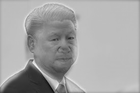

# Wei-Cheng Tseng <span style="color:red">(104061146)</span>

# Project 1 / Image Filtering and Hybrid Images

## Overview
The project is related to image filtering and [hybrid images](http://cvcl.mit.edu/hybridimage/) using a simplified version of the SIGGRAPH 2006 [paper](http://cvcl.mit.edu/publications/OlivaTorralb_Hybrid_Siggraph06.pdf) by Oliva, Torralba, and Schyns.  

In this work, we use a lowpass filter to remove the high-frequency features from image 1. Then, we get the high-frequency feature of  image 2 by substracting the low-frequency feature. Finally, we combine image 1 and image 2 and get the hybrid image.

## Implementation
1. image filtering  
	* we first pad the image with 0.  
		- `f_h`: the height of the filter  
		- `f_w`: the width of the filter  
		- code:  
		`image = np.pad(image, ((f_h//2,f_h//2), (f_w//2,f_w//2), (0,0)), 'constant', constant_values=0)`  

	* filtering operation
		- `img_c`: the number of the input channel, i.e 3 for a color image.
		- `img_h`: the height of the image
		- `img_w`: the width of the image
		- code:  
			```
			for ch in range(img_c):
			    for i in range(img_h):
			        for j in range(img_w):
				    output[i][j][ch] = np.sum(imfilter*image[i:i+f_h, j:j+f_w, ch])
			```
2. hybrid images
	* construct a 2D guass filter
		- `cutoff_frequency`: the standard deviation of the Gaussian blur that will remove the high frequencies from one image and remove the low frequencies from another image
		- code:  
		`gaussian_filter = gauss2D(shape=(cutoff_frequency*4+1,cutoff_frequency*4+1), sigma = cutoff_frequency)`
	* use the guass filter to remove the high frequency features
	* get high frequency feature by minusing the low frequency feature

## Excution
	$ python proj.py

## Installation
* package
	> numpy, matplotlib, scipy
* How to run your code?
	> `python proj1.py`
### Results

<table border=1>
<tr>
<td>


</td>
</tr>

<tr>
<td>


</td>
</tr>

<tr>
<td>


</td>
</tr>

<tr>
<td>


</td>
</tr>

</table>

### Extra Hybrid Image
<table border=1>
<tr>
<td>
<p>Donald Trump and Xi Jinping</p>




</td>
</tr>

<tr>
<td>
<p>Min Sun and Shin-Wen Lien</p>


</td>

<tr>
<td>
<p>Tsai Ling-Wen and Yoda</p>


</td>
</tr>
</table>